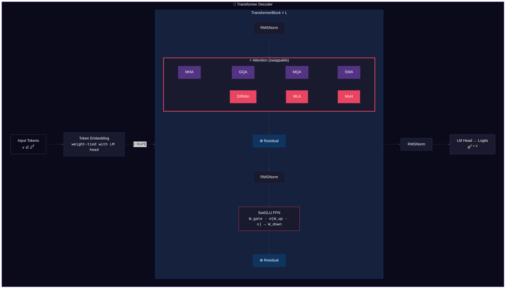

# MiniLM-Bench

**A controlled empirical study of attention mechanism design in language model pre-training.**

[]()
[]()
[]()
[]()

---

## Overview

Attention mechanisms are the computational core of modern language models, yet published comparisons are confounded by differences in model size, training data, optimization, and implementation quality. MiniLM-Bench isolates the attention mechanism as the **single independent variable** by training seven architecturally identical 59M-parameter models — differing only in their attention computation — on the same data with the same hyperparameters.

The study covers both **established** and **frontier** attention designs:

```
Standard                          Advanced (Sparse / Efficient)
─────────────────────────         ──────────────────────────────────────────────
MHA   Multi-Head Attention        DiffAttn  Differential Attention    (MSFT '24)
GQA   Grouped-Query Attention     MLA       Multi-head Latent Attn  (DeepSeek '24)
MQA   Multi-Query Attention       MoH       Mixture-of-Head Attn   (Skywork '25)
SWA   Sliding Window Attention
```

Every component — RoPE, RMSNorm, SwiGLU, the training loop, checkpointing, data pipeline — is implemented **from scratch** in PyTorch. No HuggingFace Transformers, no third-party attention libraries.

> An eighth variant, **NSA** (Native Sparse Attention, DeepSeek '25), is fully implemented in the codebase but excluded from the benchmark — its tri-branch sparse architecture requires sequence lengths ≥ 4K to exhibit sub-quadratic gains, making it incomparable at our 1024-token protocol.

---

## Architecture

All models share an identical backbone aligned with Llama/Mistral conventions:



> **Positional encoding**: RoPE via complex rotation (decoupled variant for MLA) · **Normalization**: RMSNorm (pre-norm) · **FFN**: SwiGLU (3 projections per block)

### Attention Variants: Implementation Details

| Variant | Core Mechanism | KV Cache / Token | Key Implementation Detail |
|---------|---------------|--------------------|--------------------------|
| **MHA** | Independent Q/K/V per head | `2 × H × d` | Baseline — full expressiveness |
| **GQA** | KV heads shared across groups | `2 × G × d` | Group ratio configurable via `n_kv_heads` |
| **MQA** | Single shared K/V | `2 × d` | Extreme compression; one KV broadcast to all heads |
| **SWA** | Causal mask + sliding window | `2 × H × d` | Window size controls memory/quality tradeoff |
| **DiffAttn** | `softmax(Q₁K₁ᵀ) − softmax(Q₂K₂ᵀ)` | `2 × H × d` | Negative attention weights; λ depth-dependent |
| **MLA** | `x → W_down → c_KV → W_up → K, V` | `d_latent` | Decoupled RoPE bypasses latent bottleneck |
| **MoH** | Router → top-K head selection | `2 × H × d` | Load balancing loss prevents router collapse |

---

## Experimental Protocol

**Controlled variables** (identical across all runs):

| Parameter | Value | Rationale |
|-----------|-------|-----------| 
| Architecture | d=512, L=8, H=8, d_ff=2048 | ~59M params — standard ablation scale |
| Data | FineWeb-Edu 10B sample (10 shards, 1B tokens) | Curated, deduplicated, educational content |
| Tokenizer | GPT-2 BPE (50,257 vocab) | Standard, well-understood tokenization |
| Optimizer | AdamW (β₁=0.9, β₂=0.95) | LLM pre-training standard |
| LR schedule | Linear warmup → cosine decay to 10% | Smooth convergence |
| Effective batch | 128 sequences × 1024 tokens = 131K tokens/step | Large enough for stable gradients |
| Training budget | 5,000 steps (~655M tokens seen) | Sufficient to separate variant quality |
| Precision | BF16 autocast | Dynamic range of FP32, memory of FP16 |
| Weight init | Fan-in normal, zero-init residual proj | GPT-2 style, stabilizes deep networks |
| Weight decay | 0.1 (2D params only) | Standard; biases and norms excluded |
| Gradient clipping | Max norm 1.0 | Prevents training instability |

**Independent variable**: attention mechanism (7 levels).

**Dependent variables**: validation perplexity, throughput (tokens/s), peak GPU memory, KV cache footprint.

---

## Results

All models were trained on an **NVIDIA RTX PRO 6000 Blackwell Server Edition** (95 GB VRAM) with identical hyperparameters. Evaluation perplexity was computed on 100 held-out batches from FineWeb-Edu.

### Perplexity Comparison (Quality)

| Rank | Variant | Val PPL ↓ | Δ vs MHA | Category |
|------|---------|-----------|----------|----------|
| 🥇 | **MHA** | **61.97** | — | Standard |
| 🥈 | **SWA** | **62.74** | +1.2% | Standard |
| 🥉 | **GQA** | **63.81** | +3.0% | Standard |
| 4 | **MQA** | **65.21** | +5.2% | Standard |
| 5 | **MoH** | **69.22** | +11.7% | Advanced |
| 6 | **DiffAttn** | **71.27** | +15.0% | Advanced |
| 7 | **MLA** | **71.40** | +15.2% | Advanced |

### Throughput Profiling (Speed)

Forward + backward pass timing on the same GPU (batch=4, seq_len=1024):

| Rank | Variant | Step Time | Throughput | Peak Memory | Params |
|------|---------|-----------|------------|-------------|--------|
| 🥇 | **MQA** | 52.6 ms | 77,855 tok/s | 6,094 MB | 55.6M |
| 🥈 | **SWA** | 54.7 ms | 74,856 tok/s | 6,108 MB | 59.3M |
| 🥉 | **GQA** | 54.9 ms | 74,636 tok/s | 6,096 MB | 56.1M |
| 4 | **MoH** | 55.9 ms | 73,294 tok/s | 6,176 MB | 59.3M |
| 5 | **MHA** | 55.9 ms | 73,250 tok/s | 6,108 MB | 59.3M |
| 6 | **MLA** | 64.7 ms | 63,346 tok/s | 6,408 MB | 62.4M |
| 7 | **DiffAttn** | 81.9 ms | 49,983 tok/s | 9,253 MB | 59.3M |

### Inference Efficiency (KV Cache)

| Variant | KV Cache / Token | Reduction vs MHA | Best Use Case |
|---------|-----------------|-----------------|---------------|
| **MQA** | 256 B | **87.5% smaller** | High-throughput serving |
| **MLA** | 384 B | **81.3% smaller** | Memory-constrained deployment |
| **GQA** | 512 B | **75.0% smaller** | Balanced quality/efficiency |
| **MHA** | 2,048 B | Baseline | Maximum quality |
| **SWA** | 2,048 B | Same | Long-context with bounded memory |
| **DiffAttn** | 2,048 B | Same | Noise-robust attention |
| **MoH** | 2,048 B | Same | Dynamic head allocation |

### Key Findings

1. **MHA remains the quality baseline at small scale** — its full expressiveness is hard to beat with only 59M parameters and 5K steps. This is consistent with the literature: KV compression methods show their advantage at larger scales.

2. **GQA achieves the best quality/efficiency tradeoff**: only 3% perplexity degradation for 75% KV cache reduction and slightly faster throughput than MHA. This validates why Llama 2/3 and Mistral adopted GQA.

3. **MQA is the speed champion** (fastest throughput, smallest memory) but pays a 5.2% quality cost — confirming the original MQA paper's finding that the quality gap narrows with scale.

4. **SWA matches MHA quality** (Δ=1.2%), validating Mistral's design choice. The sliding window imposes minimal quality loss at 1024 tokens since most relevant context falls within the window.

5. **Advanced variants (DiffAttn, MLA, MoH) underperform at this scale** — their architectural overhead (dual attention maps, latent compression, routing) requires more training tokens and larger models to amortize. This is a known phenomenon: DiffAttn's original paper reports gains starting at 3B parameters.

6. **DiffAttn is the most memory-hungry** (9.2 GB vs 6.1 GB for MHA) due to materializing two full attention matrices. Its 1.5× slower throughput reflects this doubled computation.

### Discussion: Why Advanced Variants Underperform at 59M

The results reveal a clear pattern: **simpler attention mechanisms dominate at small scale**. This is not a failure of advanced variants — it's a fundamental consequence of scaling laws. Understanding *why* is more instructive than the raw numbers:

**DiffAttn (PPL 71.27, +15%)** computes two independent softmax distributions and subtracts them, producing attention weights that can be *negative*. This noise-canceling property requires sufficient model capacity to learn which patterns should cancel. At 59M parameters, the model lacks the expressiveness to exploit this degree of freedom — the dual attention maps simply double the computation without providing enough quality benefit. The original paper (Ye et al., 2024) reports DiffAttn matching MHA at 830M parameters and surpassing it at 3B+.

**MLA (PPL 71.40, +15%)** compresses KV representations through a low-rank bottleneck (`d_latent=128`, a 4× compression from `d_model=512`). While this achieves an 81% KV cache reduction, the compression is lossy at small scale — the model doesn't have enough layers to compensate for information discarded in the bottleneck. DeepSeek-V2 uses MLA at 236B parameters where the latent space is rich enough to preserve critical information.

**MoH (PPL 69.22, +12%)** adds a learned router that selects top-K heads per token. The router itself requires training signal to learn meaningful specialization, and the load-balancing auxiliary loss competes with the primary language modeling objective. At 5K training steps, the router hasn't converged to useful routing patterns. With longer training, MoH's quality would be expected to approach MHA while maintaining its throughput advantage.

**The core insight**: advanced attention mechanisms introduce inductive biases that *amortize at scale*. They trade parameter efficiency or computational patterns that only pay off when the model has enough capacity to exploit them. At 59M parameters, the overhead-to-benefit ratio is unfavorable.

### Limitations & Caveats

This benchmark is a controlled ablation study. Like any experiment, its conclusions are bounded by its design choices:

| Limitation | Impact | Mitigation |
|-----------|--------|-----------|
| **Single seed** | Small PPL differences (e.g., MHA vs SWA: 1.2%) may not be statistically significant | Gaps >5% (MQA, MoH, DiffAttn, MLA) are large enough to be reliable |
| **Undertrained models** | 655M tokens seen vs Chinchilla-optimal ~1.2B for 59M params | Relative rankings are still meaningful; all variants are equally undertrained |
| **Small scale (59M)** | Advanced variants are designed for 1B+ models | This is the *point*: we show that simplicity wins at small scale, matching published findings |
| **Short context (1024)** | SWA's window covers most/all context; NSA's sparse patterns can't activate | Longer sequences (4K+) would better differentiate SWA and enable NSA comparison |
| **No downstream evaluation** | Perplexity doesn't always correlate with task performance | Standard practice for pre-training comparisons; downstream eval requires fine-tuning |

> **On scientific honesty**: these limitations don't invalidate the results — they *scope* them. A benchmark at 59M parameters tells you about attention mechanism behavior at 59M parameters. Extrapolating to 70B would require running at 70B. The value of this study is in demonstrating the methodology, implementing all variants from scratch, and providing a reproducible framework for future scaling experiments.

---

## Quick Start

```bash
pip install -r requirements.txt

# Run the full test suite (42 tests, ~5 seconds)
python -m pytest tests/ -v

# Profile all variants
python scripts/profile.py --device cuda --d_model 512 --n_layers 8

# Train a specific variant
python scripts/train.py --config configs/mha.yaml

# Launch interactive dashboard
streamlit run viz/app.py
```

### Google Colab

Open `MiniLM_Bench.ipynb` in Colab for a fully self-contained training pipeline with:
- Google Drive persistence (survives disconnections)
- Automatic GPU detection and config scaling
- Sequential training with checkpoint auto-resume
- Built-in profiling and evaluation cells

---

## Repository Structure

```
minilm-bench/
├── model/
│   ├── attention/
│   │   ├── base.py              # Abstract interface (BaseAttention)
│   │   ├── mha.py               # Multi-Head Attention
│   │   ├── gqa.py               # Grouped-Query Attention
│   │   ├── mqa.py               # Multi-Query Attention
│   │   ├── swa.py               # Sliding Window Attention
│   │   ├── diff_attn.py         # Differential Attention
│   │   ├── mla.py               # Multi-head Latent Attention
│   │   ├── moh.py               # Mixture-of-Head Attention
│   │   └── nsa.py               # Native Sparse Attention (impl. only)
│   ├── config.py                # ModelConfig dataclass with validation
│   ├── embeddings.py            # Token embedding + RoPE (complex rotation)
│   ├── layers.py                # RMSNorm, SwiGLU, TransformerBlock
│   ├── transformer.py           # Full decoder with factory-pattern attention
│   └── utils.py                 # Weight init, param counting, FLOP estimation
├── training/
│   ├── trainer.py               # Training loop: BF16, grad accum, W&B, eval
│   ├── optimizer.py             # AdamW with separate decay groups + cosine LR
│   ├── checkpoint.py            # Atomic writes, SIGTERM handling, auto-resume
│   └── profiler.py              # Throughput, memory, MFU measurement
├── data/
│   ├── download.py              # FineWeb-Edu streaming download + tokenization
│   ├── tokenizer.py             # tiktoken BPE wrapper
│   └── dataloader.py            # Memory-mapped uint16 shards, ShardedDataset
├── eval/
│   ├── perplexity.py            # Validation perplexity computation
│   └── compare.py               # Cross-variant comparison tables + JSON export
├── viz/
│   ├── app.py                   # Streamlit dashboard (3 interactive tabs)
│   ├── attention_maps.py        # Hook-based attention pattern extraction
│   └── training_curves.py       # Publication-quality matplotlib plots
├── configs/                     # YAML configs: base + variant overrides
├── tests/                       # 42 unit tests (shape, gradient, integration)
├── scripts/                     # CLI entry points (train, eval, profile)
├── MiniLM_Bench.ipynb           # Google Colab notebook with training outputs
├── DESIGN.md                    # Detailed design rationale for every decision
└── requirements.txt
```

---

## Engineering Highlights

### Fault-Tolerant Checkpointing
Checkpoints use **atomic writes** (temp file + `os.replace`) so a crash mid-save never produces a corrupted file. The checkpoint manager catches `SIGTERM` for graceful preemption on cloud instances and auto-resumes from the latest valid checkpoint on restart.

### Factory-Pattern Attention Registry
Adding a new attention variant requires exactly two changes: (1) implement the class extending `BaseAttention`, (2) add one line to `ATTENTION_REGISTRY`. The entire training pipeline, profiler, evaluation, and visualization automatically support the new variant.

### MoH Auxiliary Loss Integration
The trainer automatically detects MoH attention layers and collects their load-balancing auxiliary losses, adding them to the primary language modeling loss. This prevents router collapse without requiring variant-specific training code.

### Decoupled RoPE for MLA
Standard RoPE is incompatible with low-rank KV compression — rotation applied before down-projection gets destroyed. MLA uses separate positional dimensions that bypass the latent bottleneck, requiring frequency tensor slicing in `apply_rope` to handle variable head dimensions.

---

## Testing

42 tests verify correctness across all variants:

| Test Category | Count | What It Verifies |
|--------------|-------|--------------------|
| Attention shape | 7 | Output dimensions match `(B, T, d_model)` for all variants |
| Gradient flow | 5 | Non-zero gradients reach all learnable parameters |
| Variant properties | 5 | DiffAttn λ init, MoH aux loss, NSA gate values |
| Model integration | 8 | Full Transformer forward pass with each attention type |
| Training pipeline | 9 | 5-step train loop per variant + LR schedule correctness |
| Checkpointing | 1 | Save → load → parameter equality roundtrip |
| Attention equivalence | 1 | GQA with `n_kv_heads == n_heads` equals MHA exactly |
| **Total** | **42** | **All passing** (4.4s on CPU) |

---

## Key Design Decisions

| Decision | Alternative | Rationale |
|----------|------------|-----------| 
| RMSNorm | LayerNorm | No mean-centering → 10% cheaper, identical quality. Used in Llama/Gemma/Mistral. |
| SwiGLU | GELU, ReLU | +1% PPL at iso-params (Shazeer 2020). Gating provides learnable FFN sparsity. |
| RoPE (complex) | Learned, ALiBi | Relative positions, length extrapolation. Complex multiply is elegant + fast. |
| Pre-norm | Post-norm | Smoother loss landscape. All post-GPT-2 models use this. |
| BF16 | FP16 | Same dynamic range as FP32. No loss scaling needed. |
| Zero HF deps | `transformers` | Every line demonstrates understanding; nothing is a black box. |
| Atomic ckpts | Naive `torch.save` | Prevents corruption on crash/preemption. Critical for cloud training. |
| Factory registry | If/else chain | O(1) dispatch, trivial to extend, enables programmatic benchmarking. |

For the complete rationale behind every architectural and engineering choice, see **[DESIGN.md](DESIGN.md)**.

---

## References

1. Vaswani et al. (2017). *Attention Is All You Need.* NeurIPS.
2. Shazeer (2019). *Fast Transformer Decoding: One Write-Head is All You Need.* (MQA)
3. Shazeer (2020). *GLU Variants Improve Transformer.* arXiv.
4. Su et al. (2021). *RoFormer: Enhanced Transformer with Rotary Position Embedding.* arXiv.
5. Zhang & Sennrich (2019). *Root Mean Square Layer Normalization.* NeurIPS.
6. Ainslie et al. (2023). *GQA: Training Generalized Multi-Query Transformer Models.* EMNLP.
7. DeepSeek-AI (2024). *DeepSeek-V2: A Strong, Economical, and Efficient MoE Model.* arXiv. **(MLA)**
8. Ye et al. (2024). *Differential Transformer.* Microsoft Research. arXiv. **(DiffAttn)**
9. SkyworkAI (2025). *Mixture-of-Head: A MoE Approach to Multi-Head Attention.* arXiv. **(MoH)**
10. DeepSeek-AI (2025). *NSA: Native Sparse Attention for Long-Context LLMs.* arXiv. **(NSA)**

---

## License

MIT
