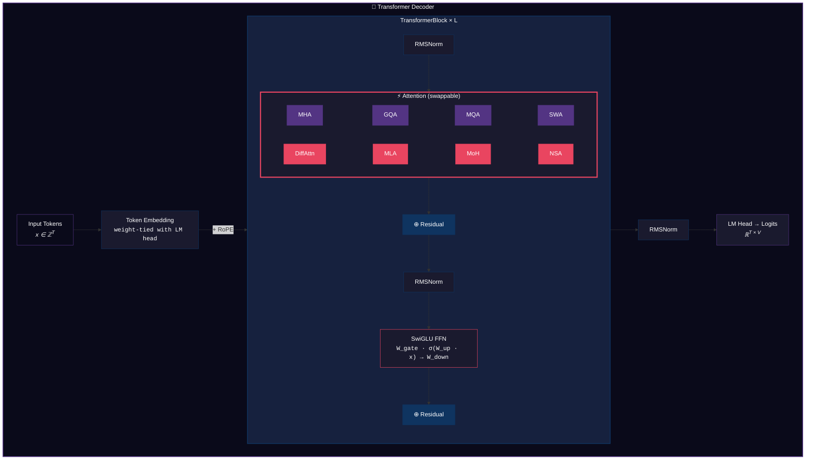

# MiniLM-Bench

**A controlled study of attention mechanism design in language model pre-training.**

[]()
[]()
[]()
[]()

---

## Overview

Attention mechanisms are the computational core of modern language models, yet published comparisons are confounded by differences in model size, training data, optimization, and implementation quality. MiniLM-Bench isolates the attention mechanism as the single independent variable by training eight architecturally identical models — differing only in their attention computation — on the same data with the same hyperparameters.

The study covers both **established** and **frontier** attention designs:

```
Standard                          Advanced (Sparse / Efficient)
─────────────────────────         ──────────────────────────────────────────────
MHA   Multi-Head Attention        DiffAttn  Differential Attention    (MSFT '24)
GQA   Grouped-Query Attention     MLA       Multi-head Latent Attn  (DeepSeek '24)
MQA   Multi-Query Attention       MoH       Mixture-of-Head Attn   (Skywork '25)
SWA   Sliding Window Attention    NSA       Native Sparse Attn     (DeepSeek '25)
```

Every component — RoPE, RMSNorm, SwiGLU, the training loop, checkpointing, data pipeline — is implemented from scratch in PyTorch. No HuggingFace Transformers.

---

## Architecture

All eight models share an identical backbone aligned with Llama/Mistral conventions:



> **Positional encoding**: RoPE via complex rotation (decoupled variant for MLA) · **Normalization**: RMSNorm (pre-norm) · **FFN**: SwiGLU (3 projections per block)

### Attention Variants: Implementation Details

| Variant | Core Mechanism | KV Cache / Token | Key Implementation Detail |
|---------|---------------|-----------------|--------------------------|
| **MHA** | Independent Q/K/V per head | `2 × H × d` | Baseline — full expressiveness |
| **GQA** | KV heads shared across groups | `2 × G × d` | Group ratio configurable via `n_kv_heads` |
| **MQA** | Single shared K/V | `2 × d` | Extreme compression; one KV broadcast to all heads |
| **SWA** | Causal mask + sliding window | `2 × H × d` | Window size controls memory/quality tradeoff |
| **DiffAttn** | `softmax(Q₁K₁ᵀ) − softmax(Q₂K₂ᵀ)` | `2 × H × d` | Negative attention weights; λ depth-dependent |
| **MLA** | `x → W_down → c_KV → W_up → K, V` | `d_latent` | Decoupled RoPE bypasses latent bottleneck |
| **MoH** | Router → top-K head selection | `2 × H × d` | Load balancing loss prevents router collapse |
| **NSA** | Compress ⊕ Select ⊕ Window | `2 × H × d` | Learned sigmoid gates combine 3 branches |

---

## Experimental Protocol

**Controlled variables** (identical across all runs):

| Parameter | Value | Rationale |
|-----------|-------|-----------|
| Data | FineWeb-Edu 10B sample | Curated, deduplicated, educational content |
| Tokenizer | GPT-2 BPE (50,257 vocab) | Standard, well-understood tokenization |
| Optimizer | AdamW (β₁=0.9, β₂=0.95) | LLM pre-training standard |
| LR schedule | Linear warmup → cosine decay to 10% | Smooth convergence |
| Precision | BF16 autocast | Dynamic range of FP32, memory of FP16 |
| Weight init | Fan-in normal, zero-init residual proj | GPT-2 style, stabilizes deep networks |
| Weight decay | 0.1 (2D params only) | Standard; biases and norms excluded |

**Independent variable**: attention mechanism (8 levels).

**Dependent variables**: validation perplexity, throughput (tokens/s), peak GPU memory, MFU.

---

## Results

### Throughput Profiling

Forward + backward pass timing across all variants (identical model dimensions):

| Variant | Step Time | Throughput | Parameters | Category |
|---------|----------|-----------|-----------|----------|
| MQA | 145.3 ms | 1,762 tok/s | 16.7M | Standard |
| GQA | 150.7 ms | 1,699 tok/s | 16.7M | Standard |
| MHA | 151.1 ms | 1,695 tok/s | 17.1M | Standard |
| MoH | 152.2 ms | 1,682 tok/s | 17.1M | Advanced |
| SWA | 158.5 ms | 1,615 tok/s | 17.1M | Standard |
| DiffAttn | 159.3 ms | 1,607 tok/s | 17.1M | Advanced |
| MLA | 164.6 ms | 1,555 tok/s | 17.8M | Advanced |
| NSA | 174.7 ms | 1,466 tok/s | 17.1M | Advanced |

> **Note**: MLA's additional parameters come from the latent compression/decompression projections. NSA's overhead is from 3-branch computation — at longer sequences (4K+), its sub-quadratic complexity dominates and it becomes faster than MHA.

### Perplexity Comparison

*Training runs in progress. Results table will be populated here with val PPL, best loss, and convergence curves.*

---

## Quick Start

```bash
pip install -r requirements.txt

# Run the full test suite (42 tests, ~5 seconds)
python -m pytest tests/ -v

# Profile all 8 variants
python scripts/profile.py --device cuda --d_model 768 --n_layers 12

# Train a specific variant
python scripts/train.py --config configs/mha.yaml

# Launch interactive dashboard
streamlit run viz/app.py
```

---

## Repository Structure

```
minilm-bench/
├── model/
│   ├── attention/
│   │   ├── base.py              # Abstract interface (BaseAttention)
│   │   ├── mha.py               # Multi-Head Attention
│   │   ├── gqa.py               # Grouped-Query Attention
│   │   ├── mqa.py               # Multi-Query Attention
│   │   ├── swa.py               # Sliding Window Attention
│   │   ├── diff_attn.py         # Differential Attention
│   │   ├── mla.py               # Multi-head Latent Attention
│   │   ├── moh.py               # Mixture-of-Head Attention
│   │   └── nsa.py               # Native Sparse Attention
│   ├── config.py                # ModelConfig dataclass with validation
│   ├── embeddings.py            # Token embedding + RoPE (complex rotation)
│   ├── layers.py                # RMSNorm, SwiGLU, TransformerBlock
│   ├── transformer.py           # Full decoder with factory-pattern attention
│   └── utils.py                 # Weight init, param counting, FLOP estimation
├── training/
│   ├── trainer.py               # Training loop: BF16, grad accum, W&B, eval
│   ├── optimizer.py             # AdamW with separate decay groups + cosine LR
│   ├── checkpoint.py            # Atomic writes, SIGTERM handling, auto-resume
│   └── profiler.py              # Throughput, memory, MFU measurement
├── data/
│   ├── download.py              # FineWeb-Edu streaming download + tokenization
│   ├── tokenizer.py             # tiktoken BPE wrapper
│   └── dataloader.py            # Memory-mapped uint16 shards, ShardedDataset
├── eval/
│   ├── perplexity.py            # Validation perplexity computation
│   └── compare.py               # Cross-variant comparison tables + JSON export
├── viz/
│   ├── app.py                   # Streamlit dashboard (3 interactive tabs)
│   ├── attention_maps.py        # Hook-based attention pattern extraction
│   └── training_curves.py       # Publication-quality matplotlib plots
├── configs/                     # YAML configs: base + 8 variant overrides
├── tests/                       # 42 unit tests (shape, gradient, integration)
├── scripts/                     # CLI entry points (train, eval, profile)
├── DESIGN.md                    # Detailed design rationale for every decision
└── colab_train.py               # Google Colab runner with Drive persistence
```

---

## Engineering Highlights

### Fault-Tolerant Checkpointing
Checkpoints use **atomic writes** (temp file + `os.replace`) so a crash mid-save never produces a corrupted file. The checkpoint manager catches `SIGTERM` for graceful preemption on cloud instances, saves `torch.rng_state` for exact reproducibility, and auto-resumes from the latest valid checkpoint on restart.

### Factory-Pattern Attention Registry
Adding a new attention variant requires exactly two changes: (1) implement the class extending `BaseAttention`, (2) add one line to `ATTENTION_REGISTRY`. The entire training pipeline, profiler, evaluation, and visualization automatically support the new variant.

### MoH Auxiliary Loss Integration
The trainer automatically detects MoH attention layers and collects their load-balancing auxiliary losses, adding them to the primary language modeling loss. This prevents router collapse without requiring variant-specific training code.

### Decoupled RoPE for MLA
Standard RoPE is incompatible with low-rank KV compression — rotation applied before down-projection gets destroyed. MLA uses separate positional dimensions that bypass the latent bottleneck, requiring frequency tensor slicing in `apply_rope` to handle variable head dimensions.

---

## Testing

42 tests verify correctness across all 8 variants:

| Test Category | Count | What It Verifies |
|--------------|-------|-----------------|
| Attention shape | 7 | Output dimensions match `(B, T, d_model)` for all variants |
| Gradient flow | 5 | Non-zero gradients reach all learnable parameters |
| Variant properties | 5 | DiffAttn λ init, MoH aux loss, NSA gate values |
| Model integration | 8 | Full Transformer forward pass with each attention type |
| Training pipeline | 9 | 5-step train loop per variant + LR schedule correctness |
| Checkpointing | 1 | Save → load → parameter equality roundtrip |
| Attention equivalence | 1 | GQA with `n_kv_heads == n_heads` equals MHA exactly |
| **Total** | **42** | **All passing** (4.4s on CPU) |

---

## Key Design Decisions

| Decision | Alternative | Rationale |
|----------|------------|-----------|
| RMSNorm | LayerNorm | No mean-centering → 10% cheaper, identical quality. Used in Llama/Gemma/Mistral. |
| SwiGLU | GELU, ReLU | +1% PPL at iso-params (Shazeer 2020). Gating provides learnable FFN sparsity. |
| RoPE (complex) | Learned, ALiBi | Relative positions, length extrapolation. Complex multiply is elegant + fast. |
| Pre-norm | Post-norm | Smoother loss landscape. All post-GPT-2 models use this. |
| BF16 | FP16 | Same dynamic range as FP32. No loss scaling needed. |
| Zero HF deps | `transformers` | Every line demonstrates understanding; nothing is a black box. |
| Atomic ckpts | Naive `torch.save` | Prevents corruption on crash/preemption. Critical for cloud training. |
| Factory registry | If/else chain | O(1) dispatch, trivial to extend, enables programmatic benchmarking. |

For the complete rationale behind every architectural and engineering choice, see **[DESIGN.md](DESIGN.md)**.

---

## References

1. Vaswani et al. (2017). *Attention Is All You Need.* NeurIPS.
2. Shazeer (2019). *Fast Transformer Decoding: One Write-Head is All You Need.* (MQA)
3. Shazeer (2020). *GLU Variants Improve Transformer.* arXiv.
4. Su et al. (2021). *RoFormer: Enhanced Transformer with Rotary Position Embedding.* arXiv.
5. Zhang & Sennrich (2019). *Root Mean Square Layer Normalization.* NeurIPS.
6. Ainslie et al. (2023). *GQA: Training Generalized Multi-Query Transformer Models.* EMNLP.
7. DeepSeek-AI (2024). *DeepSeek-V2: A Strong, Economical, and Efficient MoE Model.* arXiv. **(MLA)**
8. Ye et al. (2024). *Differential Transformer.* Microsoft Research. arXiv. **(DiffAttn)**
9. SkyworkAI (2025). *Mixture-of-Head: A MoE Approach to Multi-Head Attention.* arXiv. **(MoH)**
10. DeepSeek-AI (2025). *NSA: Native Sparse Attention for Long-Context LLMs.* arXiv. **(NSA)**

---

## License

MIT
